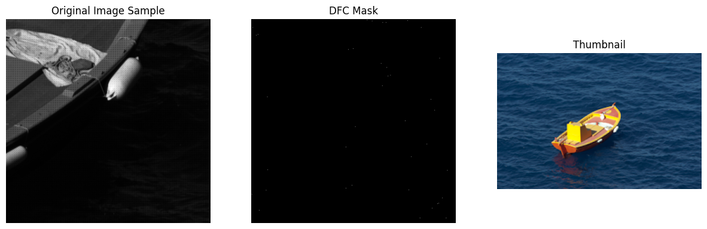
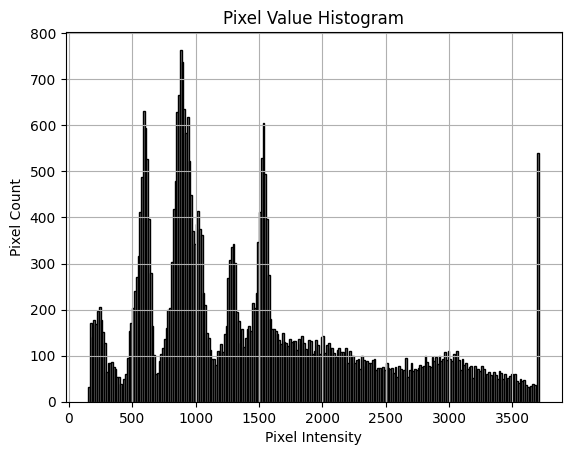
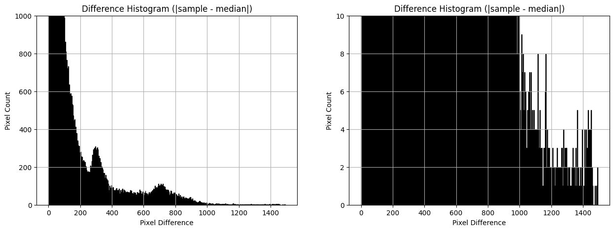
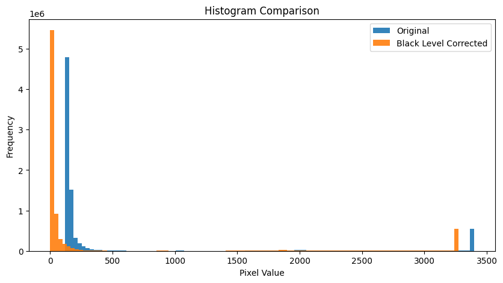
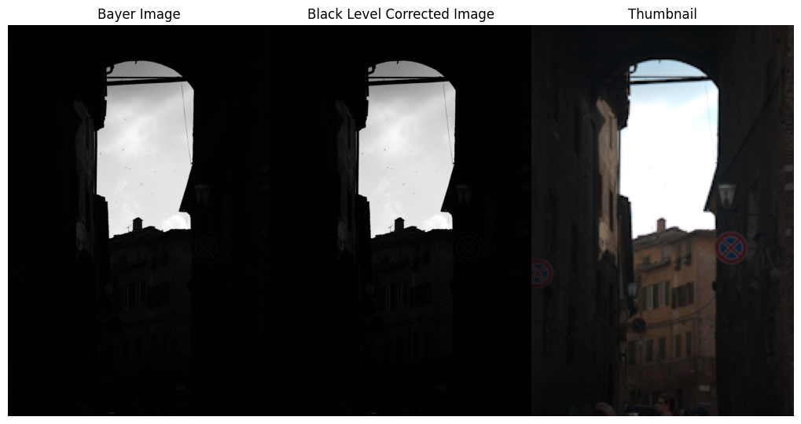
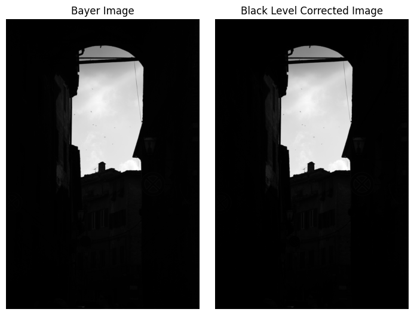
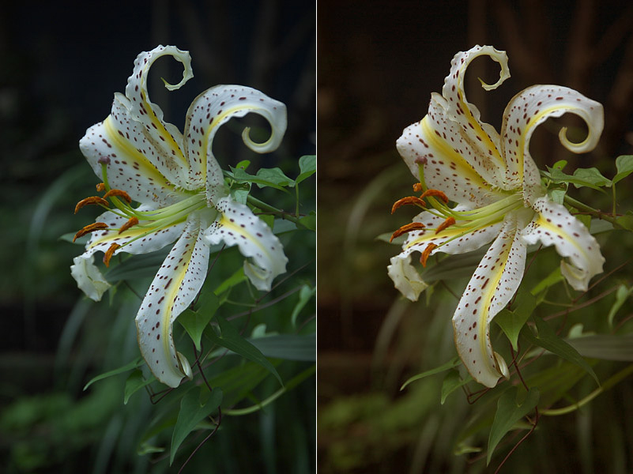
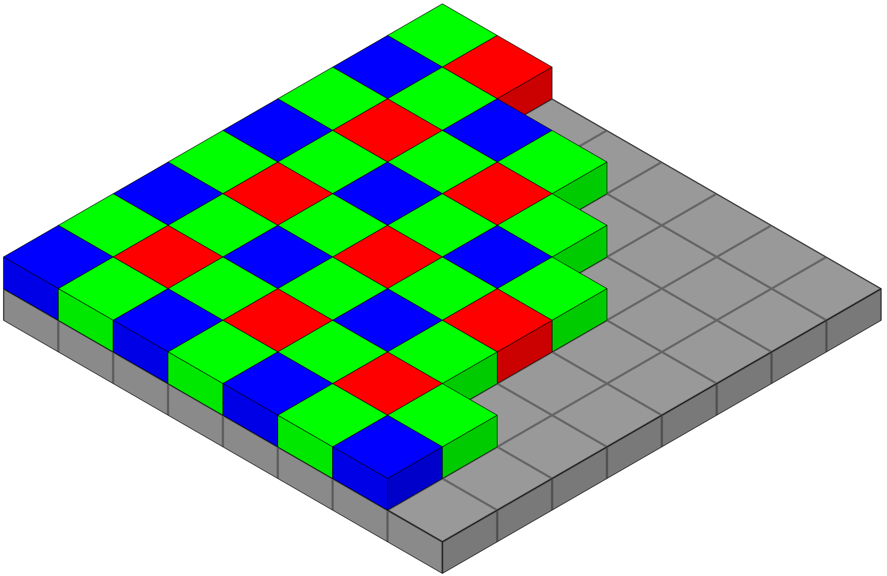
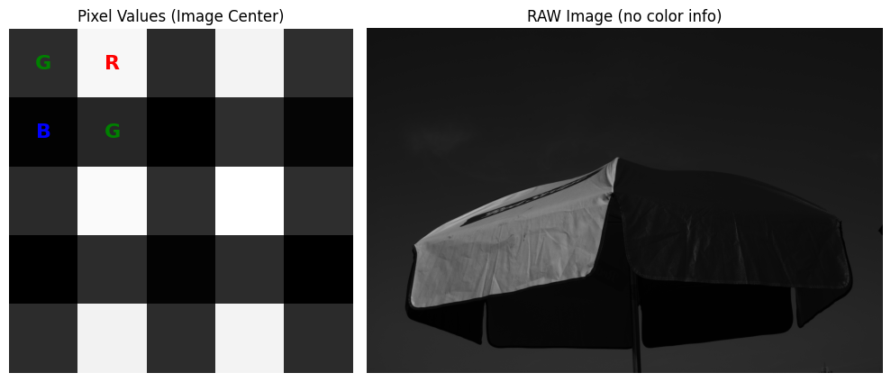
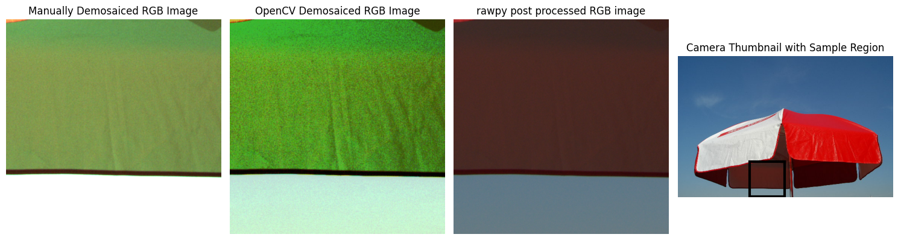

# ISP-Tuning (Public Version) 

## Intro 

Created the ISP-Tuning repository for:
- Demonstrate understanding of core ISP blocks
- Create a modular ISP pipeline to learn how each ISP block works
- Practice ISP Tuning on raw data 

#### Planned ISP block to be included

- Defective Pixel Removal
- Black Level Correction
- Lens Shading Correction
- White Balance
- Demosaicing
- Color Correction Matrix (CCM)
- Gamma Correction
- Tone Mapping & HDR Merge 
- Noise Reduction
- Edge Enhancement & Sharpening
- Color Space Conversion

Also practice 
- 3A - Auto Exposure 
- 3A - Auto White Balance
- 3A - Auto-Focus (focus compute)
- 
#### Scripting and code development Process
- For the development process, I use the local folder on Windows to keep the raw files. Installing the GitHub Desktop application seems the easiest way I found.
- The script development is on Colab and online, then the files will be downloaded locally and pushed to GitHub using the GitHub Desktop app.

#### Image files
- Were downloaded from https://data.csail.mit.edu/graphics/fivek/
- initially started using a .DNG file from my Iphone and then noticed there is no Bayer layer info for the image

#### Working with .DNG files
Key Structure of a .DNG File (TIFF-based structure)
- TIFF --> Header	Describes byte order, version
- IFD0 --> Basic info: width, height, color layout
- EXIF --> ISO, shutter speed, aperture, timestamp
- CFA Pattern --> 	Tells you the sensor’s Bayer layout (e.g., RGGB)
- ColorMatrix1/2 -->	Used for converting to XYZ or sRGB
- Raw Data --> Sensor pixel values (one color per pixel)
- Thumbnail -->	Quick embedded JPEG for previews
  
#### License
- MIT License

###########################################################################################################
## 001-Defective Pixel Removal
### Objective
- Manually run through each pixel a small sample of the image and find the pixel with values higher than the median value for the same-color surrounding pixel. WE used Von Neumann neighborhood
- Run the DFC using OpenCV
  
### Manual DPC
A small sample size was selected, and dead/hot pixels were examined. As it can be seen from the image of the DFC mask, a very small number of pixels were detected as defective. This is a very slow process as it iterates through each pixel via a for loop. 

BY looking at the pixel value histogram, it is clear that most of the pixels have values in the  lower range and only a few pixels are saturated, which is an indicator of possible hot pixels. Also, it should be noted that this is for testing the algorithm for defective pixel detection, and selecting the threshold will determine the number of pixels shown as defective.

By updating the thresholding to adjust to the median value and pixel value STD, the DPC will be more accurate. In here, the histogram of pixel value to the median value is shown, which indicates there is no defective pixel.

### Fast DPC
The DFC can be done much faster by using OpenCV, where a median filter is applied to the whole image and then comparing the absolute values of median pixel matrix to absolute values. 

###########################################################################################################
## 002-Black Level Correction
This is similar to subtracting the background noise from any sensor output. Even without any signal, a sensor will produce a (noise) signal, which can be due to electronics, shot noise, etc. The same concept applies to CMOS and CCD sensors. Black Level Correction is the process of subtracting a fixed value (the "black level") from raw sensor data to normalize pixel values, removing the sensor's electrical bias or dark current.

- For Bayer raw images, the black level is often different per channel or per row/column.
- Typically, the black level is given in metadata (e.g., EXIF, DNG tags) or assumed (e.g., 64 or 512 out of 4096 in 12-bit data).

This is simply subtracting the black level matrix from the image matrix, and is straightforward to implement.

There are different methods to extract the black level from the file, including:
- rawpy ==> rawpy.RawPy.black_level_per_channel
- exiftool ==> exiftool your_image.dng | grep -i black
- pyexiv2
- piexif

  The output of Black Level Correction here does not show a significant improvement, as the black levels were small. The values were Black Level per channel: [127, 128, 127, 127] for a bit depth =12 (0 to 4095 pixel values). By using a uint16 datatype and subtracting the black level, no visual improvement can be seen.

Now' lets truncate the data inot a uint8 (0-255 pixel values) and perform the black level correction. The output of Black Level Correction here shows a significant improvement, as the black level was high. The values were Black Level per channel: [127, 128, 127, 127] for a uint8 image (0 to 255 pixel values).

###########################################################################################################
## 003-Lens Shading Correction

Lens shading (or vignetting) occurs when image intensity varies across the sensor, typically causing the corners to be darker than the center. This happens due to a combination of optical, mechanical, and sensor-level effects.

Here are the main causes:
- Optical-Cosine Fourth Law (Natural Vignetting):
Light falls off as the angle of incidence increases from the optical axis. This is caused by lens geometry and becomes stronger in wide-angle lenses and large format sensors.

- Optical-Lens Design Limitations
Lenses are optimized for central sharpness, and so the edge illumination suffers. So the lens design and sensor size mismatch will result a lens shading, for example, if the sensor is too large for the lens design.

- Optical-Microlens Inefficiency (Pixel Vignetting)
Each pixel on a modern image sensor (CMOS or CCD) is topped with a tiny microlens to focus incoming light onto the photodiode beneath it and improve light collection efficiency (also called fill factor). At oblique angles (edge pixels), light may miss the active area.

Thus step is skipped in this pipeline due to the lack of calibration data (flat-field gain maps). In production systems, LSC compensates for luminance and chroma vignetting caused by lens and sensor imperfections. Having the LSC data, it can be implemented using:

$$
\text{Corrected}(x, y) = \min\left(\text{Raw}(x, y) \cdot \text{Gain}(x, y),\; \text{WhiteLevel} \right)
$$

###########################################################################################################
## 004-White Balance

### Objective
The objective of this section is to 
- perform WB manually on raw image using the common methods and compare the outcome to OpenCV and rawpy methods
- summarize the outcome using quantifiable metrics such as RGB histogram

###########################################################################################################
## 005-Demosiacing

### Objective
The objective of this section is to 
- extract the raw image info from .dng file and visualize what each pixel value looks like without color info
- perform a manual demosaicing on a 100x100 sample and compare to the post-processed image already stored in .dng file
- exploring different demosaicing methods: bilinear, edge-aware interpolation, Gradient-based demosaicing, deep learning-based demosaicing (e.g., PyTorch, OpenCV DNN)

#### Bayer layer info (rawpy)
The first step in performing demosaicing is to get the Bayer layer info. I used rawpy to access the Bayer layer (there are other methods too). The output returns a 2x2 matrix whose values map to RGB colors: 0=Red, 1=Green, 2=Blue, 3=Green, so the [[0 1],  [3 2]] return in our case means it is RGGB Bayer layer. This is the standard colormapping for Libraw. More details can be found here: https://www.libraw.org/docs/API-overview.html#cfa

The image used here for practice is downloaded from https://data.csail.mit.edu/graphics/fivek/ and before demosaicing the pixxel values along with the assigned CFA is shown. As it can be seen, it seems the Red pixel has a higher value (brighter color in the plot below), so we expect this part of the image to be a red dominant color. Further in here, we will plot the thumbnail, and it will become clearthat  the image indeed has a strong red color.

### Bilinear Demosaicing 
The output for the Bilinear demosaicing kernel compared OpenCV demosaicing and rawpy demosaicing. The difference in colors is due to auto WB and CCM applied to rawpy, while the other two methods only have demosaicing applied.

###########################################################################################################
## 006-Color Correction

