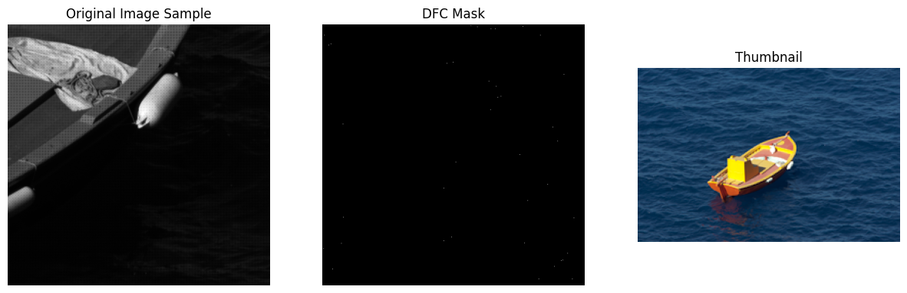

# ISP-Tuning (Public Version) 

## Intro 

Created the ISP-Tuning repository for:
- Demonstrate understanding of core ISP blocks
- Create a modular ISP pipeline to learn how each ISP block works
- Practice ISP Tuning on raw data 

#### Planned ISP block to be included

- Defective Pixel Removal
- Black Level Correction
- Lens Shading Correction
- White Balance
- Demosaicing
- Color Correction Matrix (CCM)
- Gamma Correction
- Tone Mapping & HDR Merge 
- Noise Reduction
- Edge Enhancement & Sharpening
- Color Space Conversion

Also practice 
- 3A - Auto Exposure 
- 3A - Auto White Balance
- 3A - Auto-Focus (focus compute)
- 
#### Scripting and code development Process
- For the development process, I use the local folder on Windows to keep the raw files. Installing the GitHub Desktop application seems the easiest way I found.
- The script development is on Colab and online, then the files will be downloaded locally and pushed to GitHub using the GitHub Desktop app.

#### Image files
- Were downloaded from https://data.csail.mit.edu/graphics/fivek/
- initially started using a .DNG file from my Iphone and then noticed there is no Bayer layer info for the image

#### Working with .DNG files
Key Structure of a .DNG File (TIFF-based structure)
- TIFF --> Header	Describes byte order, version
- IFD0 --> Basic info: width, height, color layout
- EXIF --> ISO, shutter speed, aperture, timestamp
- CFA Pattern --> 	Tells you the sensor’s Bayer layout (e.g., RGGB)
- ColorMatrix1/2 -->	Used for converting to XYZ or sRGB
- Raw Data --> Sensor pixel values (one color per pixel)
- Thumbnail -->	Quick embedded JPEG for previews
  
#### License
- MIT License

##########################################################################################################################################################################################

## 001-Defective Pixel Removal
### Objective
- Manually run through each pixel a small sample of the image and find the pixel with values higher than the median value for the same-color surrounding pixel. WE used Von Neumann neighborhood
- Run the DFC using OpenCV 
### Manual DPC
A small sample size was selected, and dead/hot pixels were examined. As it can be seen from the image of the DFC mask, a very small number of pixels were detected as defective. This is a very slow process as it iterates through each pixel via a for loop. 
001-DFC-Manula-output.png

##########################################################################################################################################################################################
## 001-Demosiacing

### Objective
The objective of this section is to 
- extract the raw image info from .dng file and visualize what each pixel value looks like without color info
- perform a manual demosaicing on a 100x100 sample and compare to the post-processed image already stored in .dng file
- exploring different demosaicing methods: bilinear, edge-aware interpolation, Gradient-based demosaicing, deep learning-based demosaicing (e.g., PyTorch, OpenCV DNN)

#### Bayer layer info (rawpy)
The first step in performing demosaicing is to get the Bayer layer info. I used rawpy to access the Bayer layer (there are other methods too). The output returns a 2x2 matrix whose values map to RGB colors: 0=Red, 1=Green, 2=Blue, 3=Green, so the [[0 1],  [3 2]] return in our case means it is RGGB Bayer layer. This is the standard colormapping for Libraw. More details can be found here: https://www.libraw.org/docs/API-overview.html#cfa

The image used here for practice is downloaded from https://data.csail.mit.edu/graphics/fivek/ and before demosaicing the pixxel values along with the assigned CFA is shown. As it can be seen, it seems the Red pixel has a higher value (brighter color in the plot below), so we expect this part of the image to be a red dominant color. Further in here, we will plot the thumbnail, and it will become clearthat  the image indeed has a strong red color.

### Bilinear Demosaicing 
The output for the Bilinear demosaicing kernel compared OpenCV demosaicing and rawpy demosaicing. The difference in colors is due to auto WB and CCM applied to rawpy, while the other two methods only have demosaicing applied.

## 002-White Balance

### Objective
The objective of this section is to 
- perform WB manually on raw image using the common methods and compare the outcome to OpenCV and rawpy methods
- summarize the outcome using quantifiable metrics such as RGB histogram

